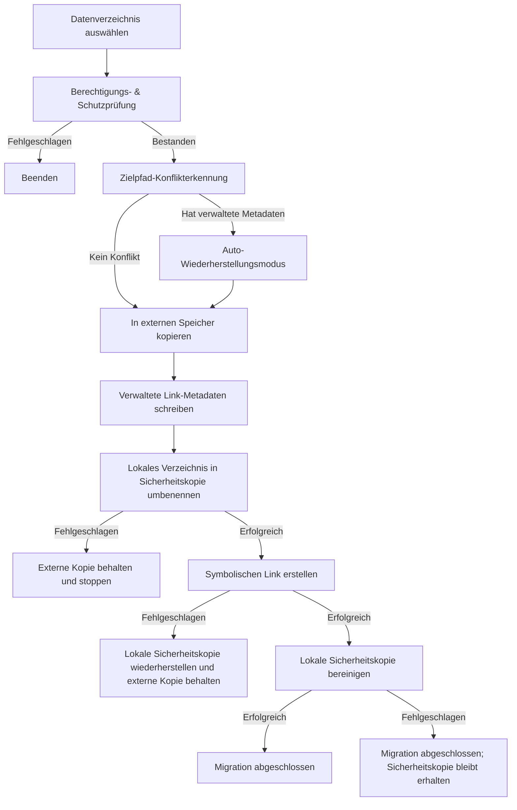

# Datenmigration - Grundlegende Implementierung


Die Datenmigrationsfunktion von AppPorts migriert app-assoziierte Datenverzeichnisse (wie `~/Library/Application Support`, `~/Library/Caches` usw.) in den externen Speicher, um lokalen Speicherplatz freizugeben.

## Kernstrategie: Symbolischer Link

Die Datenverzeichnismigration verwendet die **Whole Symlink**-Strategie:

1. Das gesamte ursprüngliche lokale Verzeichnis in den externen Speicher kopieren
2. Verwaltete Link-Metadaten (`.appports-link-metadata.plist`) im externen Verzeichnis schreiben
3. Das ursprüngliche lokale Verzeichnis auf demselben Volume in eine versteckte Sicherheitskopie umbenennen
4. Einen symbolischen Link am ursprünglichen Pfad erstellen, der auf die externe Kopie verweist
5. Die lokale Sicherheitskopie nach erfolgreicher Link-Erstellung bereinigen

```
~/Library/Application Support/SomeApp
    → /Volumes/External/AppPortsData/SomeApp  (symlink)
```

## Migrationsablauf



## Verwaltete Link-Metadaten

AppPorts schreibt eine `.appports-link-metadata.plist`-Datei im externen Verzeichnis, um zu kennzeichnen, dass das Verzeichnis von AppPorts verwaltet wird. Die Metadaten enthalten:

| Feld | Beschreibung |
|------|--------------|
| `schemaVersion` | Metadaten-Versionsnummer (aktuell 1) |
| `managedBy` | Verwaltungskennung (`com.shimoko.AppPorts`) |
| `sourcePath` | Ursprünglicher lokaler Pfad |
| `destinationPath` | Externer Speicher-Zielpfad |
| `dataDirType` | Datenverzeichnistyp |

Diese Metadaten werden beim Scannen verwendet, um von AppPorts verwaltete Links von benutzererstellten symbolischen Links zu unterscheiden, und unterstützen die automatische Wiederherstellung bei unterbrochener Migration.

Die automatische Wiederherstellung verwendet strikte Übereinstimmung. Wenn das externe Ziel bereits existiert, behandelt AppPorts es nur als wiederherstellbar, wenn `schemaVersion`, `managedBy`, `sourcePath`, `destinationPath` und `dataDirType` mit dem aktuellen Vorgang übereinstimmen. Ein echtes Verzeichnis ohne passende Metadaten gilt als Konflikt; AppPorts stellt nicht allein aufgrund ähnlicher Verzeichnisgrößen wieder her und übernimmt es auch nicht.

Neuverlinkung und Normalisierung arbeiten nur mit Verzeichnissen. AppPorts weist externe normale Dateien zurück, statt sie als Datenverzeichnisse neu zu verlinken oder zu verschieben. So wird verhindert, dass eine Datei durch einen lokalen symbolischen Link ersetzt wird.

## Unterstützte Datenverzeichnistypen

| Typ | Pfadbeispiel |
|-----|-------------|
| `applicationSupport` | `~/Library/Application Support/` |
| `preferences` | `~/Library/Preferences/` |
| `containers` | `~/Library/Containers/` |
| `groupContainers` | `~/Library/Group Containers/` |
| `caches` | `~/Library/Caches/` |
| `webKit` | `~/Library/WebKit/` |
| `httpStorages` | `~/Library/HTTPStorages/` |
| `applicationScripts` | `~/Library/Application Scripts/` |
| `logs` | `~/Library/Logs/` |
| `savedState` | `~/Library/Saved Application State/` |
| `dotFolder` | `~/.npm`, `~/.vscode` usw. |
| `custom` | Benutzerdefinierter Pfad |

## Wiederherstellungsablauf

1. Überprüfen, ob der lokale Pfad ein symbolischer Link ist, der auf ein gültiges externes Verzeichnis verweist
2. Lokalen symbolischen Link entfernen
3. Externes Verzeichnis zurück in den lokalen Speicher kopieren
4. Externes Verzeichnis löschen (best effort)

Falls das Kopieren fehlschlägt, wird automatisch der symbolische Link wiederhergestellt, um die Konsistenz zu wahren.

## Fehlerbehandlung & Rollback

Jeder kritische Schritt im Migrationsprozess enthält Rollback-Mechanismen:

- **Kopierfehler**: Keine weiteren Aktionen; bereinigen der kopierten externen Dateien
- **Fehler beim Verschieben in die lokale Sicherheitskopie**: Migration stoppt und behält die externe Kopie; die lokale Quelle wird nicht gelöscht
- **Fehler beim Erstellen des symbolischen Links**: AppPorts stellt nach Möglichkeit die lokale Sicherheitskopie am ursprünglichen Pfad wieder her und behält die externe Kopie, damit nicht beide Seiten verloren gehen
- **Fehler beim Bereinigen der Sicherheitskopie**: Die Migration gilt als abgeschlossen; ein lokaler Ordner `.appports-migration-backup-*` bleibt erhalten und kann nach Prüfung manuell entfernt werden

Dieses Design stellt sicher, dass bei einem Fehler in jeder Phase kein Datenverlust auftritt und der Systemzustand konsistent bleibt.
