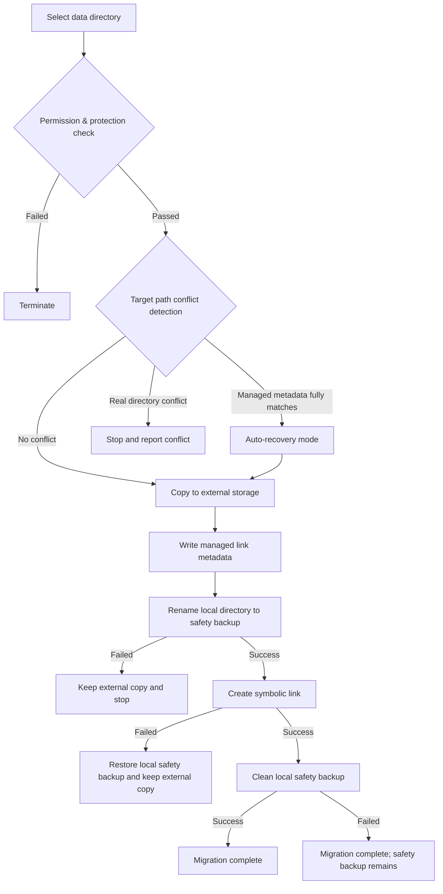

# Data Migration Basic Implementation


AppPorts' data migration feature migrates app-associated data directories (such as `~/Library/Application Support`, `~/Library/Caches`, etc.) to external storage to free up local disk space.

## Core Strategy: Symbolic Link

Data directory migration uses the **Whole Symlink** strategy:

1. Copy the entire original local directory to external storage
2. Write managed link metadata (`.appports-link-metadata.plist`) to the external directory
3. Rename the original local directory to a hidden safety backup on the same volume
4. Create a symbolic link at the original path pointing to the external copy
5. Clean up the local safety backup after the symbolic link is created successfully

```
~/Library/Application Support/SomeApp
    → /Volumes/External/AppPortsData/SomeApp  (symlink)
```

## Migration Flow



## Managed Link Metadata

AppPorts writes a `.appports-link-metadata.plist` file in the external directory to identify that the directory is managed by AppPorts. The metadata includes:

| Field | Description |
|-------|-------------|
| `schemaVersion` | Metadata version number (currently 1) |
| `managedBy` | Manager identifier (`com.shimoko.AppPorts`) |
| `sourcePath` | Original local path |
| `destinationPath` | External storage target path |
| `dataDirType` | Data directory type |

This metadata is used during scanning to distinguish AppPorts-managed links from user-created symbolic links, and supports automatic recovery when migration is interrupted.

Automatic recovery uses strict matching. When the external target already exists, AppPorts only treats it as recoverable if `schemaVersion`, `managedBy`, `sourcePath`, `destinationPath`, and `dataDirType` all match the current operation. A real directory without matching metadata is treated as a conflict; AppPorts no longer recovers or takes over based on similar directory size.

Relinking and normalization only operate on directories. AppPorts rejects external regular files instead of relinking or moving them as data directories, preventing a file from being replaced by a local symbolic link.

## Supported Data Directory Types

| Type | Path Example |
|------|-------------|
| `applicationSupport` | `~/Library/Application Support/` |
| `preferences` | `~/Library/Preferences/` |
| `containers` | `~/Library/Containers/` |
| `groupContainers` | `~/Library/Group Containers/` |
| `caches` | `~/Library/Caches/` |
| `webKit` | `~/Library/WebKit/` |
| `httpStorages` | `~/Library/HTTPStorages/` |
| `applicationScripts` | `~/Library/Application Scripts/` |
| `logs` | `~/Library/Logs/` |
| `savedState` | `~/Library/Saved Application State/` |
| `dotFolder` | `~/.npm`, `~/.vscode`, etc. |
| `custom` | User-defined path |

## Restore Flow

1. Verify local path is a symbolic link pointing to a valid external directory
2. Remove local symbolic link
3. Copy external directory back to local
4. Delete external directory (best effort)

If copying fails, automatically rebuild the symbolic link to maintain consistency.

## Error Handling & Rollback

Each critical step in the migration process includes rollback mechanisms:

- **Copy failure**: No further actions taken; clean up copied external files
- **Destination conflict**: If the external target already contains a real directory without matching metadata, migration stops and leaves both sides untouched
- **Move to local safety backup failure**: Stop migration and keep the external copy; the local source is not deleted
- **Create symbolic link failure**: Restore the local safety backup to the original path when possible, and keep the external copy to avoid losing both sides
- **Safety backup cleanup failure**: Migration is still considered complete; a `.appports-migration-backup-*` folder remains locally and can be removed manually after verification

This design ensures no data loss and consistent system state in the event of failure at any stage.
