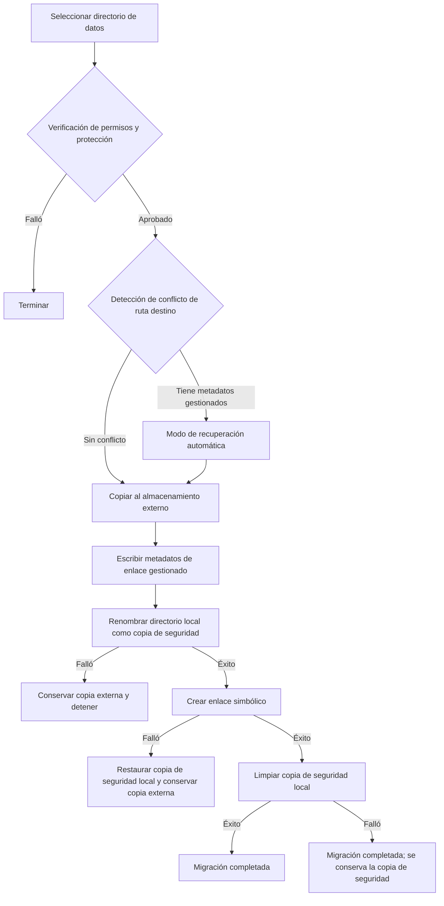

# Implementación Básica de Migración de Datos


La función de migración de datos de AppPorts migra los directorios de datos asociados a las aplicaciones (como `~/Library/Application Support`, `~/Library/Caches`, etc.) al almacenamiento externo para liberar espacio en el disco local.

## Estrategia Principal: Enlace Simbólico

La migración del directorio de datos utiliza la estrategia **Whole Symlink**:

1. Copia el directorio local original completo al almacenamiento externo
2. Escribe metadatos de enlace gestionado (`.appports-link-metadata.plist`) en el directorio externo
3. Renombra el directorio local original como una copia de seguridad oculta en el mismo volumen
4. Crea un enlace simbólico en la ruta original apuntando a la copia externa
5. Limpia la copia de seguridad local cuando el enlace simbólico se crea correctamente

```
~/Library/Application Support/SomeApp
    → /Volumes/External/AppPortsData/SomeApp  (symlink)
```

## Flujo de Migración



## Metadatos de Enlace Gestionado

AppPorts escribe un archivo `.appports-link-metadata.plist` en el directorio externo para identificar que el directorio es gestionado por AppPorts. Los metadatos incluyen:

| Campo | Descripción |
|-------|-------------|
| `schemaVersion` | Número de versión de metadatos (actualmente 1) |
| `managedBy` | Identificador del gestor (`com.shimoko.AppPorts`) |
| `sourcePath` | Ruta local original |
| `destinationPath` | Ruta destino del almacenamiento externo |
| `dataDirType` | Tipo de directorio de datos |

Estos metadatos se utilizan durante el escaneo para distinguir los enlaces gestionados por AppPorts de los enlaces simbólicos creados por el usuario, y soportan la recuperación automática cuando la migración se interrumpe.

La recuperación automática usa coincidencia estricta. Cuando el destino externo ya existe, AppPorts solo lo trata como recuperable si `schemaVersion`, `managedBy`, `sourcePath`, `destinationPath` y `dataDirType` coinciden con la operación actual. Un directorio real sin metadatos coincidentes se trata como conflicto; AppPorts no recupera ni toma control basándose solo en tamaños de directorio similares.

La revinculación y la normalización solo operan sobre directorios. AppPorts rechaza archivos normales externos en lugar de revincularlos o moverlos como directorios de datos, evitando que un archivo sea reemplazado por un enlace simbólico local.

## Tipos de Directorios de Datos Soportados

| Tipo | Ejemplo de Ruta |
|------|----------------|
| `applicationSupport` | `~/Library/Application Support/` |
| `preferences` | `~/Library/Preferences/` |
| `containers` | `~/Library/Containers/` |
| `groupContainers` | `~/Library/Group Containers/` |
| `caches` | `~/Library/Caches/` |
| `webKit` | `~/Library/WebKit/` |
| `httpStorages` | `~/Library/HTTPStorages/` |
| `applicationScripts` | `~/Library/Application Scripts/` |
| `logs` | `~/Library/Logs/` |
| `savedState` | `~/Library/Saved Application State/` |
| `dotFolder` | `~/.npm`, `~/.vscode`, etc. |
| `custom` | Ruta definida por el usuario |

## Flujo de Restauración

1. Verificar que la ruta local es un enlace simbólico que apunta a un directorio externo válido
2. Eliminar el enlace simbólico local
3. Copiar el directorio externo de vuelta a local
4. Eliminar el directorio externo (mejor esfuerzo)

Si la copia falla, se reconstruye automáticamente el enlace simbólico para mantener la consistencia.

## Manejo de Errores y Rollback

Cada paso crítico en el proceso de migración incluye mecanismos de rollback:

- **Fallo en la copia**: No se toman más acciones; se limpian los archivos externos copiados
- **Fallo al mover la copia de seguridad local**: La migración se detiene y se conserva la copia externa; el origen local no se elimina
- **Fallo al crear enlace simbólico**: AppPorts intenta restaurar la copia de seguridad local en la ruta original y conserva la copia externa para evitar perder ambos lados
- **Fallo al limpiar la copia de seguridad**: La migración se considera completada; queda una carpeta `.appports-migration-backup-*` local que puede eliminarse manualmente tras verificar los datos

Este diseño garantiza que no se pierdan datos y que el estado del sistema sea consistente en caso de fallo en cualquier etapa.
