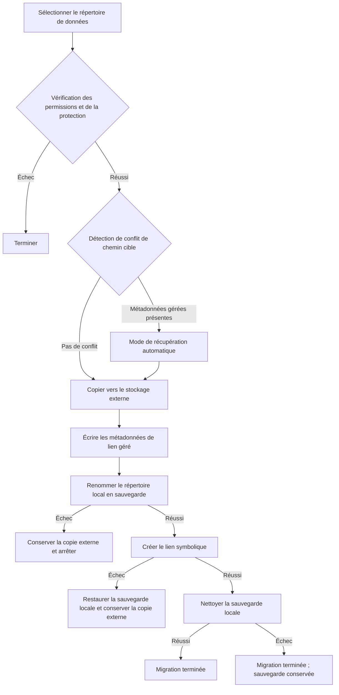

# Implémentation de base de la migration des données


La fonctionnalité de migration des données d'AppPorts migre les répertoires de données associés aux applications (tels que `~/Library/Application Support`, `~/Library/Caches`, etc.) vers le stockage externe pour libérer de l'espace disque local.

## Stratégie principale : Lien symbolique

La migration des répertoires de données utilise la stratégie **Whole Symlink** :

1. Copier l'intégralité du répertoire local original vers le stockage externe
2. Écrire les métadonnées de lien géré (`.appports-link-metadata.plist`) dans le répertoire externe
3. Renommer le répertoire local original en sauvegarde de sécurité cachée sur le même volume
4. Créer un lien symbolique à l'emplacement d'origine pointant vers la copie externe
5. Nettoyer la sauvegarde locale après la création réussie du lien symbolique

```
~/Library/Application Support/SomeApp
    → /Volumes/External/AppPortsData/SomeApp  (symlink)
```

## Flux de migration



## Métadonnées de lien géré

AppPorts écrit un fichier `.appports-link-metadata.plist` dans le répertoire externe pour identifier que le répertoire est géré par AppPorts. Les métadonnées incluent :

| Champ | Description |
|-------|-------------|
| `schemaVersion` | Numéro de version des métadonnées (actuellement 1) |
| `managedBy` | Identifiant du gestionnaire (`com.shimoko.AppPorts`) |
| `sourcePath` | Chemin local original |
| `destinationPath` | Chemin cible du stockage externe |
| `dataDirType` | Type de répertoire de données |

Ces métadonnées sont utilisées lors de l'analyse pour distinguer les liens gérés par AppPorts des liens symboliques créés par l'utilisateur, et supportent la récupération automatique en cas d'interruption de la migration.

La récupération automatique utilise une correspondance stricte. Quand la cible externe existe déjà, AppPorts ne la traite comme récupérable que si `schemaVersion`, `managedBy`, `sourcePath`, `destinationPath` et `dataDirType` correspondent à l'opération actuelle. Un vrai répertoire sans métadonnées correspondantes est traité comme un conflit ; AppPorts ne récupère ni ne reprend un répertoire sur la seule base d'une taille similaire.

La re-liaison et la normalisation ne s'appliquent qu'aux répertoires. AppPorts rejette les fichiers ordinaires externes au lieu de les relier ou de les déplacer comme des répertoires de données, ce qui évite qu'un fichier soit remplacé par un lien symbolique local.

## Types de répertoires de données supportés

| Type | Exemple de chemin |
|------|-------------------|
| `applicationSupport` | `~/Library/Application Support/` |
| `preferences` | `~/Library/Preferences/` |
| `containers` | `~/Library/Containers/` |
| `groupContainers` | `~/Library/Group Containers/` |
| `caches` | `~/Library/Caches/` |
| `webKit` | `~/Library/WebKit/` |
| `httpStorages` | `~/Library/HTTPStorages/` |
| `applicationScripts` | `~/Library/Application Scripts/` |
| `logs` | `~/Library/Logs/` |
| `savedState` | `~/Library/Saved Application State/` |
| `dotFolder` | `~/.npm`, `~/.vscode`, etc. |
| `custom` | Chemin défini par l'utilisateur |

## Flux de restauration

1. Vérifier que le chemin local est un lien symbolique pointant vers un répertoire externe valide
2. Supprimer le lien symbolique local
3. Copier le répertoire externe vers le local
4. Supprimer le répertoire externe (dans la mesure du possible)

Si la copie échoue, reconstruit automatiquement le lien symbolique pour maintenir la cohérence.

## Gestion des erreurs et annulation

Chaque étape critique du processus de migration inclut des mécanismes d'annulation :

- **Échec de la copie** : Aucune action supplémentaire ; nettoyage des fichiers externes copiés
- **Échec du déplacement vers la sauvegarde locale** : La migration s'arrête et conserve la copie externe ; la source locale n'est pas supprimée
- **Échec de la création du lien symbolique** : AppPorts tente de restaurer la sauvegarde locale vers le chemin d'origine et conserve la copie externe pour éviter de perdre les deux côtés
- **Échec du nettoyage de la sauvegarde** : La migration est tout de même considérée comme terminée ; un dossier `.appports-migration-backup-*` reste en local et peut être supprimé manuellement après vérification

Cette conception garantit l'absence de perte de données et un état système cohérent en cas d'échec à n'importe quelle étape.
