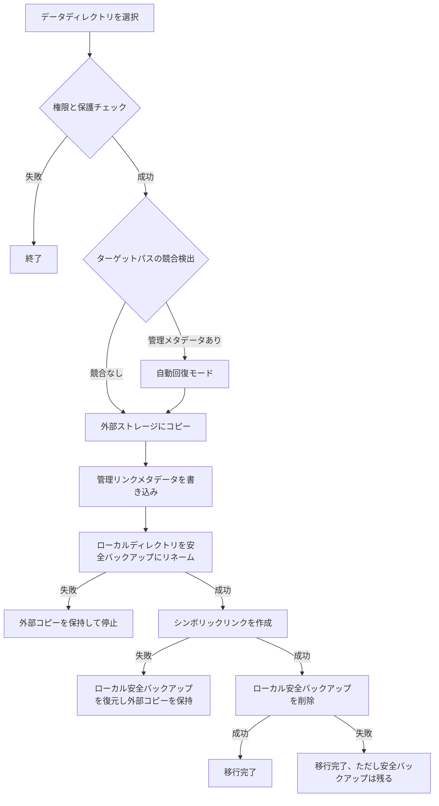

# データ移行の基本実装


AppPorts のデータ移行機能は、アプリに関連するデータディレクトリ（`~/Library/Application Support`、`~/Library/Caches` など）を外部ストレージに移行し、ローカルのディスク容量を解放します。

## コア戦略：シンボリックリンク

データディレクトリの移行には**Whole Symlink**戦略を使用します：

1. 元のローカルディレクトリ全体を外部ストレージにコピー
2. 管理リンクメタデータ（`.appports-link-metadata.plist`）を外部ディレクトリに書き込む
3. 元のローカルディレクトリを同じボリューム上の隠し安全バックアップにリネーム
4. 元のパスに外部コピーを指すシンボリックリンクを作成
5. シンボリックリンク作成後にローカル安全バックアップを削除

```
~/Library/Application Support/SomeApp
    → /Volumes/External/AppPortsData/SomeApp  (symlink)
```

## 移行フロー



## 管理リンクメタデータ

AppPorts は、そのディレクトリが AppPorts によって管理されていることを識別するために、外部ディレクトリに `.appports-link-metadata.plist` ファイルを書き込みます。メタデータには以下の情報が含まれます：

| フィールド | 説明 |
|-----------|------|
| `schemaVersion` | メタデータバージョン番号（現在は1） |
| `managedBy` | 管理者識別子（`com.shimoko.AppPorts`） |
| `sourcePath` | 元のローカルパス |
| `destinationPath` | 外部ストレージのターゲットパス |
| `dataDirType` | データディレクトリタイプ |

このメタデータはスキャン時に使用され、AppPorts 管理のリンクとユーザーが作成したシンボリックリンクを区別し、移行中断時の自動回復をサポートします。

自動回復では厳密な一致を使用します。外部ターゲットがすでに存在する場合、`schemaVersion`、`managedBy`、`sourcePath`、`destinationPath`、`dataDirType` が現在の操作とすべて一致するときだけ、AppPorts は回復可能な対象として扱います。一致するメタデータがない実ディレクトリは競合として扱われ、ディレクトリサイズが近いだけでは回復や引き継ぎを行いません。

再リンクと正規化はディレクトリだけを対象にします。AppPorts は外部の通常ファイルをデータディレクトリとして再リンクまたは移動することを拒否し、ファイルがローカルのシンボリックリンクに置き換わることを防ぎます。

## サポートされるデータディレクトリタイプ

| タイプ | パスの例 |
|--------|---------|
| `applicationSupport` | `~/Library/Application Support/` |
| `preferences` | `~/Library/Preferences/` |
| `containers` | `~/Library/Containers/` |
| `groupContainers` | `~/Library/Group Containers/` |
| `caches` | `~/Library/Caches/` |
| `webKit` | `~/Library/WebKit/` |
| `httpStorages` | `~/Library/HTTPStorages/` |
| `applicationScripts` | `~/Library/Application Scripts/` |
| `logs` | `~/Library/Logs/` |
| `savedState` | `~/Library/Saved Application State/` |
| `dotFolder` | `~/.npm`、`~/.vscode` など |
| `custom` | ユーザー定義パス |

## 復元フロー

1. ローカルパスが有効な外部ディレクトリを指すシンボリックリンクであることを確認
2. ローカルのシンボリックリンクを削除
3. 外部ディレクトリをローカルにコピー
4. 外部ディレクトリを削除（ベストエフォート）

コピーに失敗した場合、一貫性を維持するためにシンボリックリンクを自動的に再構築します。

## エラーハンドリングとロールバック

移行プロセスの各重要なステップには、ロールバックメカニズムが含まれています：

- **コピー失敗**: それ以上のアクションは実行されない；コピーされた外部ファイルをクリーンアップ
- **ローカル安全バックアップへの移動失敗**: 移行を停止し、外部コピーを保持します。ローカルの元ディレクトリは削除されません
- **シンボリックリンク作成失敗**: 可能な場合はローカル安全バックアップを元のパスへ復元し、外部コピーも保持して両側のデータ消失を避けます
- **安全バックアップ削除失敗**: 移行自体は完了扱いです。ローカルに `.appports-migration-backup-*` フォルダが残るため、確認後に手動削除できます

この設計により、どの段階で失敗が発生してもデータの損失がなく、システム状態の一貫性が保証されます。
